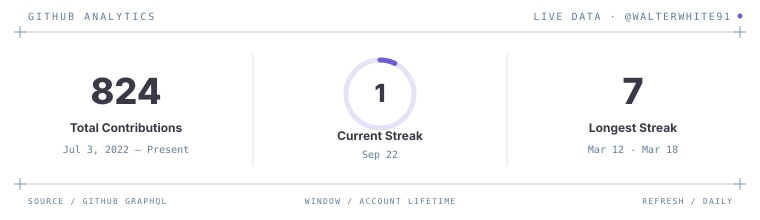
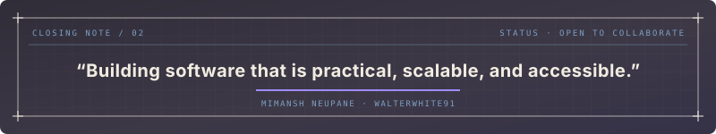

<div align="center">



<br />


<br></br>

<a href="https://www.linkedin.com/in/mimansh-neupane/"></a>
&nbsp;
<a href="mailto:mimansh_np@proton.me"></a>


</div>

## About Me

I'm a **Computer Science undergraduate** passionate about building intelligent software systems that combine **Artificial Intelligence**, **backend engineering**, and **scalable infrastructure**.

### Currently building with

```
❯ Large Language Models (LLMs)
❯ Retrieval-Augmented Generation (RAG)
❯ AI Agents & Automation
❯ Backend Architecture
❯ Linux & Self-hosted Infrastructure
❯ Open Source
```

## Tech Stack

| Area | Stack |
| :--- | :--- |
| **Languages** |  |
| **Frameworks** |  |
| **Databases** |  |
| **Infrastructure** |  |

## GitHub Analytics

<div align="center">



</div>

## Contribution Graph

<div align="center">



</div>

## Open to Collaborate

**AI Engineering** · **Backend Development** · **Open Source** · **Linux Infrastructure** · **Research Projects**

<br />

<div align="center">



<br />

⭐ If you like my work, consider following or collaborating on one of my projects.

</div>
